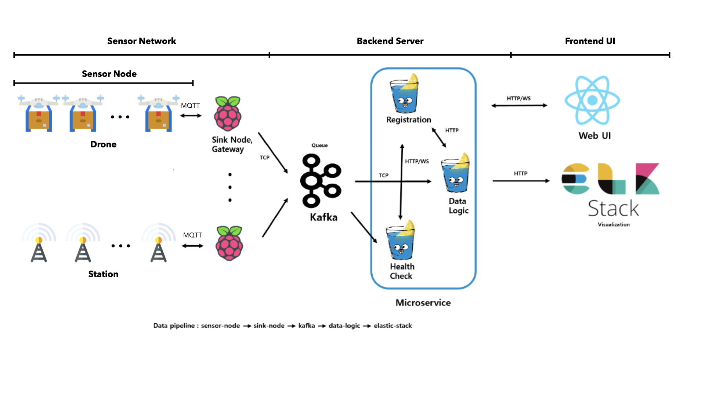
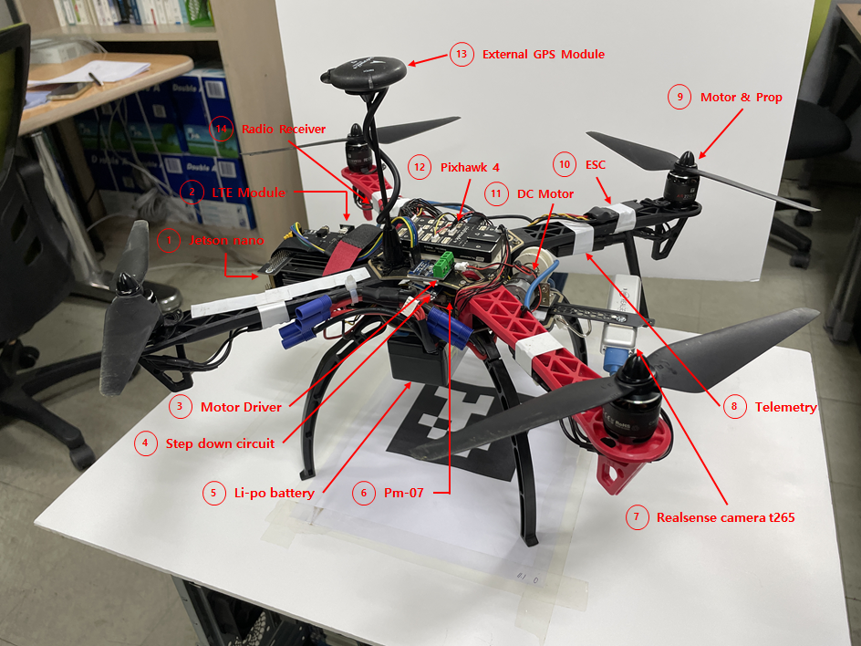
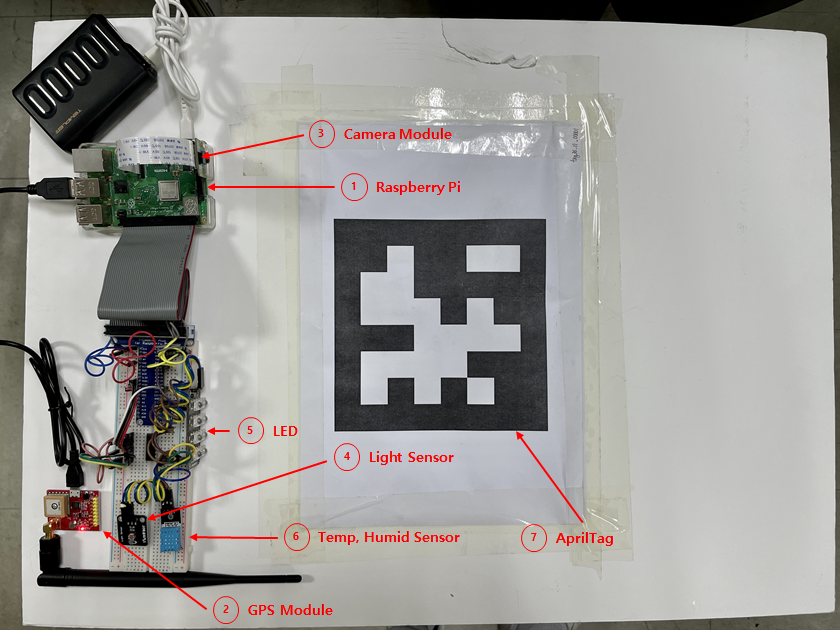
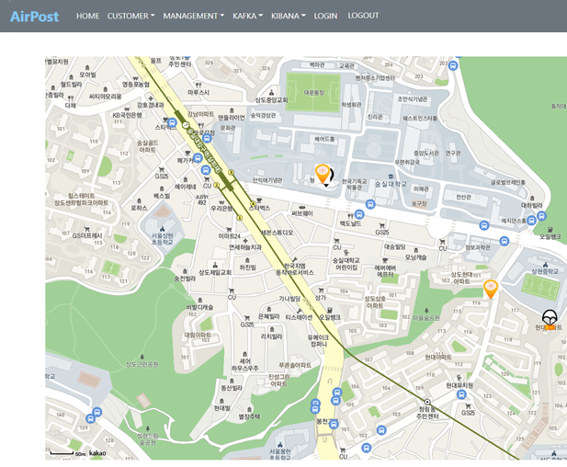
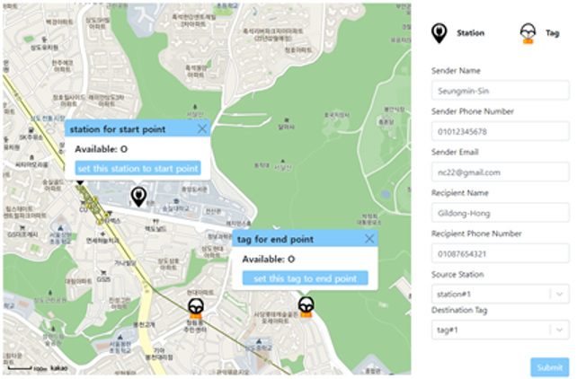
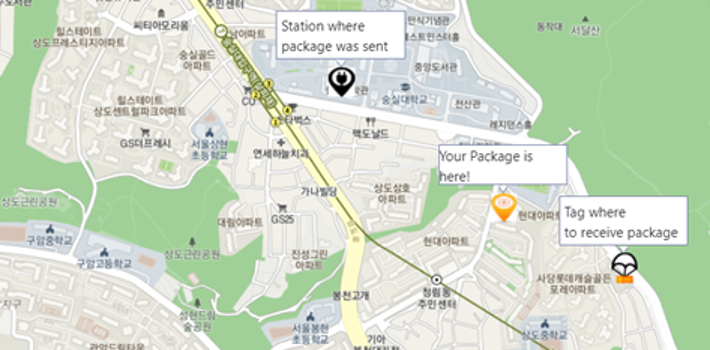

# 2021ESWContest_free_1139

  
## 소개

안녕하세요 2021년 임베디드 소프트웨어 경진대회에 참가한 SCH팀 입니다.

저희의 프로젝트명은 AirPost입니다.

AirPost는 IoT 플랫폼과 UI를 이용하여 다수의 노드(station, drone, tag)들을 효과적으로 관리하면서, 기존의 서비스와는 다르게 개인 간 배송을 지원하고, 가벼운 물품 을 가까운 거리에서 빠르게 전달하는 것에 특화된 무인 드론 택배 서비스입니다.

[시연동영상](https://youtu.be/zj5VMQE8P9Q)

## 전체 구성도

  

드론, station 을 노드로 하여 서버가 IoT 플랫폼으로 작동한다. UI를 통해 AirPost가 제공하는 서비스를 보여준다.

## 작품 사진

- Drone

  

- Station

  

- AirPost Home UI

  

- Delivery Registration UI

   

- Realtime Package Tracking UI

    

## 기능 요약

1. 관리자 기기 관리
   1. 관리자는 서비스를 제공하는데 필요한 노드(drone, station, tag)들을 UI에서 등록 및 삭제할 수 있으며, 그 결과는 데이터베이스에 저장된다.
   2. 노드들은 health-check를 통해 지속적으로 상태를 확인할 수 있다.
   3. 관리자는 저장된 노드 정보를 데이터베이스를 통해 조회할 수 있으며, 읽은 정보를 UI에 표시하여 노드들을 효과적으로 관리할 수 있다.
       라) 관리자는 로직을 통해 노드들을 제어할 수 있다. 예를 들어, station의 조도 센서값으로 filter를 지정해 station 주변이 어두울 경우 LED를 켜고, 밝을 경우 끄는 등의 action을 수행하도록 할 수 있다.
2. 사용자 택배 등록
   1. 사용자는 UI에서 필요한 폼을 작성하고, 출발 station과 도착 tag를 선 택하여 drone 택배 배송을 등록할 수 있다.
   2. 배송이 등록되면 송장번호가 발급되며, 배송 정보를 데이터베이스에 저장하고, 네이버 API로 비행할 경로를 받아와 drone에 전송한다.
3. Drone의 비행
   1. drone은 서버로부터 mqtt 방식으로 전달받은 비행 경로를 pixhawk에 입력하고, 이륙하여, 경로대로 비행할 수 있다.
   2. drone은 지속적으로 상태 정보와 좌표를 서버로 전송한다.
   3. 택배 전달 지점에 도착시 DC motor를 동작시켜 택배를 지면으로 내리고, 이 후 DC motor를 반대 방향으로 동작시켜 줄을 감는다.
   4. 택배를 전달한 이후, drone은 서버로 배송 완료 메시지를 보내고, 서버에서는 사용자가 등록한 이메일로 배송 완료 알림을 보내준다.
4. Drone의 착륙
   1. 착륙 장소까지는 GPS를 통해 비행하며, 착륙 장소 근처에 도착 시 April tag를 카메라로 인식한다.
   2. Pixhawk를 통해 drone의 좌표와 April tag 좌표의 차를 계산하고 drone의 자세를 보정시켜, April tag 위에 정확히 착륙할 수 있다.
5. 사용자 택배 추적
   1. 사용자는 UI에서 송장번호로 택배 추적을 요청할 수 있다.
   2. 요청이 들어오면 데이터베이스로부터 출발 station과 도착 tag, drone의 실시간 좌표를 읽어와 UI의 지도에 나타낸다.
6. 데이터 수집, 시각화
   1.  노드로부터 수집되는 센서 데이터들을 elastic stack을 이용하여 효과적 으로 수집, 저장 및 분석할 수 있다.
   2.  저장된 데이터들은 실시간에 가까운 속도로 검색, 집계가 가능하며, Kibana를 이용하여 그래프 등의 형태로 시각화 할 수 있다.

### 센서네트워크

1. Repository
   1. AirPost_Drone
   2. AirPost_Sink
   3. AirPost_Station
2. 개발 내용
   1. 드론, Station 설계 및 제작
   2.  Sink Node 개발
   3. Jetson nano와 서버의 통신 연결 개발
   4. ROS 드론 제어, 데이터 수집 코드 개발
   5. 싱크노드, 센서 노드, 데이터 서버 연결

### 프론트엔드 UI

1. Repository
   1. AirPost_UI
2. 개발 내용
   1. 오픈 소스를 바탕으로 Airpost에 맞게 관리자 UI 수정하여 구성
   2. 관리자 UI에서 node 등록, 삭제, 시각화 등의 기능 구현
   3. 사용자들에게 택배 서비스를 제공하기 위한 사용자 UI 구성
   4. 사용자 UI에서는 택배 등록과 조회 기능 구현

### 백엔드 서버

1. Repository
   1. AirPost
   2. docker-elasticsearch-kibana
2. 개발 내용
   1. application 서버에 기기 등록 및 사용자 택배 등록 기능 구현
   2. 사용자가 택배를 등록할 시 발생하는 logic 및 event 발생 구현
   3. tracking 작업을 위한 health-check 서버 구현

