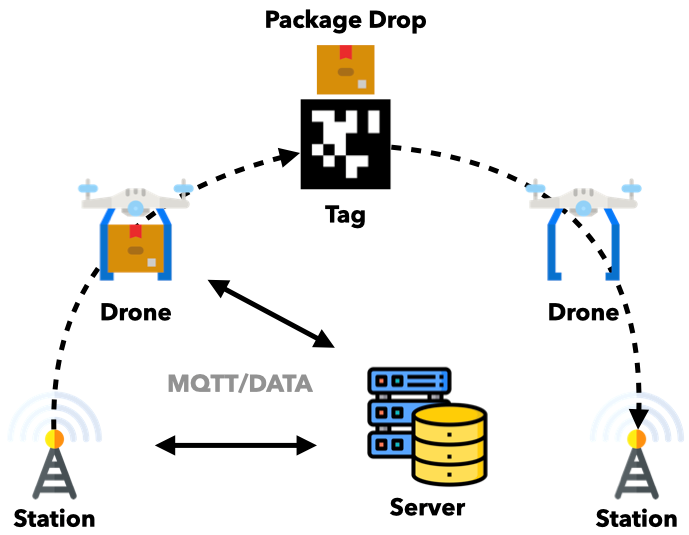

# AirPost

## 소개 / Introduction

안녕하세요, 저희는 숭실대학교 NCLab에 소속된 SCH팀 입니다.

AirPost는 무인 드론 택배 서비스로, 일반 사람들이 택배 접수, 실시간 위치 추적, 발송 완료 알림과 같은 서비스를 이용할 수 있게 하며, 본 시스템을 운영하는 관리자는 시스템 내 기기들을 효과적으로 관리할 수 있도록 합니다.
  
 
  
Hello, we are the SCH team of Soongsil University NClab.

AirPost is an unmanned drone courier service that enables the public to access services such as courier reception, real-time location tracking, and dispatch completion notifications, and allows administrators who operate the system to effectively manage devices in the system.

## 데모 영상 / Demo Video
https://youtu.be/zj5VMQE8P9Q

## 전체 구성도 / Overall Configuration Plot

  

•IoT 플랫폼에서 가장 말단에 IoT 기기들인 Sensor Node가 있고, Drone과 Station 등이 이에 속한다. Drone은 실제로 비행하여 택배를 전달하는 비행체이고, Station은 Drone이 이착륙하는 공간이다.

•Tag는 인쇄된 AprilTag로 구성된 드론이 택배를 전달하는 장소로, 전달 장소 노드로 등록된다.

•Sink Node는 IoT기기에 적합한 가벼운 통신 방식인 MQTT를 사용하여 Sensor Node의 센서 데이터를 수집하고, TCP를 사용하여 수집한 데이터를 백엔드 서버인 Kafka 서버로 전송하는 중간 서버이다. Kafka는 Sink Node서버로부터 수집한 데이터를 병렬적으로 처리한다.

•백엔드 서버는 센서 데이터를 보강하여 저장하고, 노드에게 명령을 내리거나 elastic stack에 보낸다. 또한, 프론트로부터 등록된 데이터를 MySQL 데이터베이스에 저장한다.

•프론트는 서버로부터 받은 정보를 사용자 UI를 통해 보여주며, elastic stack을 통해 시각화 한다. 사용자의 요청이 들어온 경우에는 서버로 명령을 전달한다.

 

•SensorNode, which is IoT devices, is at the very end of the IoT platform, and Drone and Station are included. Drone is an aircraft that actually flies and delivers packages, and Station is a space where Drone takes off and lands.

•Tag is a place where a drone composed of a printed AprilTag delivers a parcel, and is registered as a delivery place node.

•SinkNode is an intermediate server that collects sensor data from SensorNode using MQTT, a light communication method suitable for IoT devices, and transmits the collected data using TCP to the Kafka server, a backend server. Kafka processes data collected from the Sink Node server in parallel.

•Backend servers reinforce and store sensor data, issue commands to nodes, or send them to elastic stacks. It also stores data registered from the front desk in the MySQL database.

•The front shows the information received from the server through the user UI and visualizes it through the elastic stack. When a user's request is received, the command is delivered to the server.

## 작품 사진 / Photos

- Drone

  

- Station

  

- AirPost Home UI

  

- Delivery Registration UI

   

- Realtime Package Tracking UI

    

## 기능 설명 / Functional Description

1. 관리자 기기 관리
   1. 관리자는 서비스를 제공하는데 필요한 노드(drone, station, tag)들을 UI에서 등록 및 삭제할 수 있으며, 그 결과는 데이터베이스에 저장된다.
   2. 노드들은 health-check를 통해 지속적으로 상태를 확인할 수 있다.
   3. 관리자는 저장된 노드 정보를 데이터베이스를 통해 조회할 수 있으며, 읽은 정보를 UI에 표시하여 노드들을 효과적으로 관리할 수 있다.
   4. 관리자는 로직을 통해 노드들을 제어할 수 있다. 예를 들어, station의 조도 센서값으로 filter를 지정해 station 주변이 어두울 경우 LED를 켜고, 밝을 경우 끄는 등의 action을 수행하도록 할 수 있다.
2. 사용자 택배 등록
   1. 사용자는 UI에서 필요한 폼을 작성하고, 출발 station과 도착 tag를 선 택하여 drone 택배 배송을 등록할 수 있다.
   2. 배송이 등록되면 송장번호가 발급되며, 배송 정보를 데이터베이스에 저장하고, 네이버 API로 비행할 경로를 받아와 drone에 전송한다.
3. Drone의 비행
   1. drone은 서버로부터 mqtt 방식으로 전달받은 비행 경로를 pixhawk에 입력하고, 이륙하여, 경로대로 비행할 수 있다.
   2. drone은 지속적으로 상태 정보와 좌표를 서버로 전송한다.
   3. 택배 전달 지점에 도착시 DC motor를 동작시켜 택배를 지면으로 내리고, 이 후 DC motor를 반대 방향으로 동작시켜 줄을 감는다.
   4. 택배를 전달한 이후, drone은 서버로 배송 완료 메시지를 보내고, 서버에서는 사용자가 등록한 이메일로 배송 완료 알림을 보내준다.
4. Drone의 착륙
   1. 착륙 장소까지는 GPS를 통해 비행하며, 착륙 장소 근처에 도착 시 April tag를 카메라로 인식한다.
   2. Pixhawk를 통해 drone의 좌표와 April tag 좌표의 차를 계산하고 drone의 자세를 보정시켜, April tag 위에 정확히 착륙할 수 있다.
5. 사용자 택배 추적
   1. 사용자는 UI에서 송장번호로 택배 추적을 요청할 수 있다.
   2. 요청이 들어오면 데이터베이스로부터 출발 station과 도착 tag, drone의 실시간 좌표를 읽어와 UI의 지도에 나타낸다.
6. 데이터 수집, 시각화
   1.  노드로부터 수집되는 센서 데이터들을 elastic stack을 이용하여 효과적 으로 수집, 저장 및 분석할 수 있다.
   2.  저장된 데이터들은 실시간에 가까운 속도로 검색, 집계가 가능하며, Kibana를 이용하여 그래프 등의 형태로 시각화 할 수 있다.

 

1. Administrator Device Management
   1. The administrator can register and delete nodes (drone, station, tag) required to provide the service from the UI, and the results are stored in the database.
   2. Nodes can continuously check their status through health-check.
   3. Administrators can view stored node information through a database and effectively manage nodes by displaying the read information on the UI.
   4. The administrator may control the nodes through logic. For example, filter can be designated as the illumination sensor value of the station to perform actions such as turning on the LED when the area around the station is dark and turning off when it is bright.
2. User courier registration
   1. The user can fill out the required form in the UI and select the departure station and arrival tag to register drone courier delivery.
   2. When the delivery is registered, an invoice number is issued, the delivery information is stored in the database, and the route to fly is received by Naver API and transmitted to the drone.
3. Drone's Flight
   1. Drone can enter the flight path received from the server in the mqtt manner into pixhawk, take off, and fly along the path.
   2. Drone continuously transmits status information and coordinates to the server.
   3. When arriving at the delivery point, operate the DC motor to lower the delivery to the ground, and then operate the DC motor in the opposite direction to wind the string.
   4. After delivering the package, drone sends a delivery completion message to the server, and the server sends a delivery completion notification to the email registered by the user.
4. Drone's Landing
   1. Flight to the landing site via GPS, and the April tag is recognized by the camera when arriving near the landing site.
   2. Calculate the difference between the drone coordinates and the April tag coordinates through Pixhawk, correct the drone's posture, and land on the April tag accurately.
5. User Delivery Tracking
   1. The user can request delivery tracking from the UI to the invoice number.
   2. When a request is received, the real-time coordinates of the departure station, arrival tag, and drone are read from the database and displayed on the map of the UI.
6. Data collection, visualization
   1. Sensor data collected from nodes can be effectively collected, stored, and analyzed using elastic stacks.
   2. Stored data can be searched and aggregated at a speed close to real time, and visualized in the form of graphs using Kibana.
   
### 센서네트워크 / SensorNetwork

1. Repository
   1. AirPost_Drone
   2. AirPost_Sink
   3. AirPost_Station
2. 개발 내용 / Development content
   1. 드론, Station 설계 및 제작 / Design and manufacture of drones and stations
   2. Sink Node 개발 / Development of Sink Node
   3. Jetson nano와 서버의 통신 연결 개발 / Development of communication connection between Jetsonano and server
   4. ROS 드론 제어, 데이터 수집 코드 개발 / Development of ROS drone control and data collection code
   5. 싱크노드, 센서 노드, 데이터 서버 연결 / Connecting sink nodes, sensor nodes, and data servers

### 프론트엔드 UI / Frontent UI

1. Repository
   1. AirPost_UI
2. 개발 내용 / Development content
   1. 오픈 소스를 바탕으로 Airpost에 맞게 관리자 UI 수정하여 구성 / Modified and configured the administrator UI to suit Airpost based on open source.
   2. 관리자 UI에서 node 등록, 삭제, 시각화 등의 기능 구현 / Implemented functions such as node registration, deletion, and visualization in the administrator UI
   3. 사용자들에게 택배 서비스를 제공하기 위한 사용자 UI 구성 / User UI configuration to provide delivery service to users
   4. 사용자 UI의 택배 등록과 조회 기능 구현 / Implementation of the courier registration and inquiry function of the user UI

### 백엔드 서버 / Backend Server

1. Repository
   1. AirPost
   2. docker-elasticsearch-kibana
2. 개발 내용 / Development Content
   1. application 서버에 기기 등록 및 사용자 택배 등록 기능 구현 / Implementation of device registration and user courier registration with application server
   2. 사용자가 택배를 등록할 시 발생하는 logic 및 event 발생 구현 / Implementation of logics and events that occur when a user registers a parcel.
   3. tracking 작업을 위한 health-check 서버 구현 / Implemented a health-check server for tracking operations

