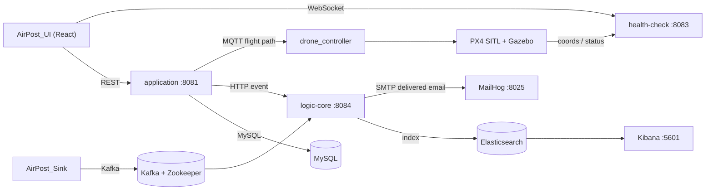

# AirPost

<p align="center"></p>

**AirPost is an unmanned drone-delivery service.** A user registers a parcel in a web UI,
the backend picks a station and a route, a drone flies the mission, drops the parcel,
precision-lands back on a station, the user gets a "delivered" email, and the whole flight
is tracked live on a map.

The flight is no longer hardware-only: the **full delivery mission runs in physics**
(PX4 v1.17 SITL + Gazebo Harmonic). See **[`simulation/README.md`](./simulation/README.md)**
for the simulator — it flies takeoff → winch delivery → AprilTag precision-land and verifies
it automatically.

Demo video: https://youtu.be/zj5VMQE8P9Q

---

## The flow (one vertical spine)

```
UI  (register parcel)
 │   AirPost_UI/ui — React
 ▼
backend  POST /regist/delivery        (pick station + route)
 │   AirPost/application — Go, :8081 (MySQL)
 ▼
MQTT  (flight path / delivery request)
 ▼
drone_controller  (MAVROS / MAVSDK commands)
 │   AirPost_Drone/.../drone_controller  +  simulation/ service
 ▼
PX4 SITL  (22 takeoff → 16 goto → 21 land)   ── visualized in QGroundControl
 │   simulation/  (Gazebo Harmonic, downward camera, DetachableJoint winch)
 ▼
"delivered" event
 ├──► logic-core email action  ──►  MailHog  (dev mailserver captures the email)
 │     AirPost/logic-core — Go, :8084
 └──► live drone coords  ──►  health-check WebSocket  ──►  UI map
       AirPost/health-check — Go, :8083
```

Sensor data takes a parallel path: sink nodes publish over MQTT, a **Sink** server forwards
to **Kafka**, **logic-core** consumes, enriches, runs rules (e.g. the email action), and ships
to **Elasticsearch**; **Kibana** visualizes it.

### Architecture (components)


```mermaid
flowchart LR
  UI["AirPost_UI (React)"] -->|REST| APP["application :8081"]
  UI -->|WebSocket| HC["health-check :8083"]
  APP -->|MySQL| DB[(MySQL)]
  APP -->|HTTP event| LC["logic-core :8084"]
  SINK["AirPost_Sink"] -->|Kafka| KAFKA[(Kafka + Zookeeper)]
  KAFKA --> LC
  LC -->|index| ES[(Elasticsearch)]
  ES --> KB["Kibana :5601"]
  LC -->|SMTP delivered email| MH["MailHog :8025"]
  APP -->|MQTT flight path| DC["drone_controller"]
  DC --> PX4["PX4 SITL + Gazebo"]
  PX4 -->|coords / status| HC
```

---

## Repositories (git submodules)

| Path | What it is |
|---|---|
| `AirPost/` | Go backend: `application` (REST + DB), `logic-core` (Kafka/ES/email rules), `health-check` (WS tracking) |
| `AirPost_UI/` | React frontend (admin dashboard + user parcel flow + tracking map) |
| `AirPost_Drone/` | On-drone ROS code: `drone_controller` (MAVROS), MQTT bridge |
| `AirPost_Sink/` | Sink node: MQTT → Kafka forwarder |
| `AirPost_Station/` | Station sensors/actuators |
| `docker-elasticsearch-kibana/` | Original standalone ES/Kibana compose |
| `simulation/` | **PX4 + Gazebo full-mission physics sim** (see its README) |

Backend service ports: `application` **8081**, `health-check` **8083** (WS listen 8085),
`logic-core` **8084**. Infra: MySQL **3306**, Kafka **9092**, Zookeeper **2181**,
Elasticsearch **9200**, Kibana **5601**, MailHog SMTP **1025** / web **8025**.

---

## How to run the demo

Clone with submodules:

```bash
git clone --recurse-submodules <repo-url> NC_AirPost
cd NC_AirPost
```

**1. Bring up the whole stack** — one command builds and starts the infra
(MySQL, Kafka, Zookeeper, Elasticsearch, Kibana, MailHog, MQTT), the three Go services,
and the UI:

```bash
cd AirPost
docker compose up --build -d
docker compose ps        # wait for application / logic-core / health-check / ui-next
```

| URL | Service |
|---|---|
| http://localhost:4173 | UI (ui-next) |
| http://localhost:8081/swagger/index.html | application REST API |
| http://localhost:5601 | Kibana |
| http://localhost:8025 | MailHog (captured "delivered" emails) |

Dev accounts (override for anything real): `admin@airpost.local` / `admin`,
`user@airpost.local` / `user`.

**2. Run the live sim + flight agent** (native — needs a GL/GPU context) — see
**[`simulation/README.md`](./simulation/README.md)**. One command opens the Gazebo window
(on the **real baylands park terrain**) and starts a persistent flight agent that listens for
orders on the same `mosquitto:1883` broker the backend uses. The agent holds a long-lived MAVSDK
link, so each order lifts off ~immediately:

```bash
cd simulation
./run_airpost_live.sh        # wait for "AGENT READY"
```

**3. Do the demo:** open the UI, register a parcel, watch the PX4 drone fly
takeoff → deliver → precision-land over the baylands terrain (in Gazebo / QGroundControl), see
the live track on the UI map, and read the "delivered" email in MailHog. One MQTT order = one
sortie.

**Full step-by-step:** [`docs/RUNBOOK.md`](./docs/RUNBOOK.md).
**Architecture + sequence diagrams:** [`docs/ARCHITECTURE.md`](./docs/ARCHITECTURE.md).
**Kibana dashboard:** [`kibana/README.md`](./kibana/README.md).
**Security checklist:** [`SECURITY.md`](./SECURITY.md).

> Tearing down: `docker compose -f AirPost/docker-compose.yml down` (add `-v` to drop volumes).

---

## Functional overview

1. **Admin device management** — register/delete nodes (drone, station, tag); live health-check status; rule/logic editor; Kibana panels.
2. **User parcel registration** — fill the form, pick source station + destination tag, get a tracking number; route computed and pushed to the drone over MQTT.
3. **Drone flight** — receives the path, takes off from a station helipad, cruises to the nearest open drop-pad clearing, lowers the parcel on the winch onto the pad, releases it.
4. **Drone landing** — flies to the landing station by GPS, then **AprilTag camera precision-landing** onto the station helipad.
5. **Parcel tracking** — query by tracking number; source/dest/drone shown live on the UI map.
6. **Data collection & viz** — sensor streams via Kafka → Elasticsearch → Kibana.

For the original full bilingual project description (photos, sensor-network / frontend /
backend breakdown), see the submodule READMEs and the project roadmap in
[`ROADMAP.md`](./ROADMAP.md).

<p align="right"></p>
