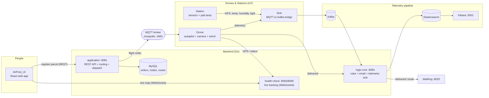

# AirPost — Autonomous Drone Parcel Delivery

<p align="center"></p>

<p align="center">
<b>Order a parcel in a web page → a drone flies it across a park, lowers it onto a landing pad,
camera-lands itself back home, and you get a "delivered" email — all tracked live on a map.</b>
</p>

<p align="center">
🎥 Demo video: <a href="https://youtu.be/zj5VMQE8P9Q">https://youtu.be/zj5VMQE8P9Q</a>
&nbsp;·&nbsp; Built by <b>SSU NC-Lab</b>
</p>

---

## 1. What is this, in one minute?

Imagine a courier company, but the couriers are **autonomous drones** and the depots are small
**landing stations** scattered around a site. AirPost is the *whole system* that makes that work:

- a **website** where you (or an operator) register a parcel and pick where it goes,
- a **brain** (backend servers) that chooses which drone flies, plans the route, and tracks everything,
- the **drones and stations** themselves — each is a little internet-connected device (an *IoT*
  device) that reports its GPS, temperature, humidity and light, and lights up a lamp at night so
  the drone can still see the landing marker,
- and a **physics simulator** so you can watch the entire delivery happen on your laptop — no real
  drone required.

A single delivery looks like this:

> **Register** parcel in the UI → backend **assigns the nearest free drone** and a route →
> drone **takes off**, flies to the pickup, **lowers the parcel by a winch onto a red drop-pad** →
> flies to the destination station → **uses its downward camera to land exactly on a marker** →
> you get a **"delivered" email** and watched the whole flight **live on a map**.

> [!NOTE]
> **New to drones / robotics?** Jump to the [**Glossary**](#11-glossary-zero-base-friendly) at the
> bottom — every acronym (PX4, SITL, MAVSDK, MQTT, Kafka, AprilTag, EKF…) is explained in one line.

---

## 2. Why does it need so many pieces?

A real delivery network has several very different jobs, and each needs different technology — that's
why the project is split into the parts below. The split is deliberate, not accidental complexity:

| The job | What it really requires | Which part does it |
|---|---|---|
| **Let people order & operators manage** | a friendly web app | **AirPost_UI** (React) |
| **Decide, route, remember, notify** | reliable servers + a database + rules | **AirPost_Backend** (Go services + MySQL) |
| **Move parcels through the air, safely** | flight control, vision, collision-avoidance | **the drone autopilot + flight service** (PX4 + `simulation/`) |
| **Sense the world & stay online** | tiny always-on devices with sensors | **AirPost_Drone / AirPost_Station / AirPost_Sink** (IoT) |
| **Stream, store & visualise telemetry** | a high-throughput data pipe | **Kafka → Elasticsearch → Kibana** |
| **Prove it works without risking hardware** | a physics world | **`simulation/`** (Gazebo) |

If all of this lived in one program it would be impossible to test, scale, or run partly on a drone
and partly in the cloud. Splitting it lets each piece be developed, deployed and verified on its own.

---

## 3. How it all fits together (the big picture)


```mermaid
flowchart LR
  subgraph People
    UI["AirPost_UI<br/>React web app"]
  end
  subgraph Brain["Backend (Go)"]
    APP["application :8081<br/>REST API + routing + dispatch"]
    LC["logic-core :8084<br/>rules + email + telemetry sink"]
    HC["health-check :8083/8085<br/>live tracking (WebSocket)"]
    DB[("MySQL<br/>orders, nodes, routes")]
  end
  subgraph Edge["Drones & Stations (IoT)"]
    DRO["Drone<br/>autopilot + camera + winch"]
    STA["Station<br/>sensors + pad lamp"]
    SINK["Sink<br/>MQTT to Kafka bridge"]
  end
  subgraph Data["Telemetry pipeline"]
    KAFKA[("Kafka")]
    ES[("Elasticsearch")]
    KB["Kibana :5601"]
  end
  MQTT(["MQTT broker<br/>mosquitto :1883"])

  UI -->|"register parcel (REST)"| APP
  UI -->|"live map (WebSocket)"| HC
  APP --> DB
  APP -->|"flight order"| MQTT
  MQTT --> DRO
  DRO -->|"GPS / status"| HC
  DRO -->|"delivered"| LC
  STA -->|"GPS, temp, humidity, light"| SINK
  DRO -->|"telemetry"| SINK
  SINK --> KAFKA --> LC --> ES --> KB
  LC -->|"'delivered' email"| MAIL["MailHog :8025"]
```

**Read it as three flows:**

1. **The order flow (left → flight):** UI → `application` → MQTT → drone. One order = one sortie.
2. **The tracking flow (flight → UI):** the drone streams its position to `health-check`, which
   pushes it over a WebSocket to the live map.
3. **The data flow (everything → dashboards):** every device streams sensor readings through the
   **Sink** into **Kafka**; `logic-core` consumes them, runs rules (e.g. "on *delivered*, send an
   email"), and stores everything in **Elasticsearch** for **Kibana** dashboards.

---

## 4. The delivery mission, step by step

This is exactly what the autopilot does on every sortie (and what you see in the simulator):

```
1. TAKEOFF          lift off vertically from the home station helipad
2. CRUISE           fly to the parcel's drop site at an assigned altitude band
                    (each drone gets its own band so two drones never share an altitude → no collision)
3. DESCEND          come straight down to ~10 m above the red drop-pad
4. WINCH            lower the parcel on a cable and set it down ON the red box, then release
5. CLIMB & CRUISE   rise back to the band, fly to the destination landing station
6. APPROACH         arrive over the station; if another drone is landing there, HOLD to the side
7. PRECISION LAND   from a few metres up, the downward camera finds the AprilTag marker and the
                    drone steers itself onto the tag centre — not just "near the pad", on the mark
8. DELIVERED        publish status → "delivered" email fires, tracking map updates
```

Two safety ideas run through the whole fleet:

- **No two drones ever collide.** Cruise altitudes are separated into bands; when two drones need
  the *same* drop pad or landing pad, one waits to the side until the other clears.
- **Vision, not just GPS, for the final metre.** GPS / the drone's own position estimate can be off
  by tens of centimetres. The camera + AprilTag closes that gap so the parcel lands *on the pad* and
  the drone lands *on the marker*. (See the honest accuracy notes in [§8](#8-project-status--whats-verified).)

---

## 5. Repository map (git submodules)

This umbrella repo pulls every part together as submodules. Clone with `--recurse-submodules`.

| Path | What it is | Stack |
|---|---|---|
| [`simulation/`](./simulation/README.md) | **The physics simulation** — flies the whole mission (takeoff → winch → camera precision-land) for 1–N drones, no hardware needed. Start here to *see* it work. | PX4 SITL, Gazebo Harmonic, Python, MAVSDK |
| [`AirPost_Backend/`](./AirPost_Backend) | **The brain.** Three Go services: `application` (REST API, routing, drone dispatch, MySQL), `logic-core` (Kafka consumer, rule engine, "delivered" email, Elasticsearch sink), `health-check` (WebSocket live-tracking). | Go, Gin, GORM, MySQL |
| [`AirPost_UI/`](./AirPost_UI) | **The web app.** Operator dashboard (manage drones/stations/tags, see health), parcel registration, and the live tracking map. | React, Vite, TypeScript |
| [`AirPost_Drone/`](./AirPost_Drone) | **On-drone IoT + control.** Raspberry-Pi sensor node (GPS, camera, temp/humidity/light) and the autopilot command bridge. | Python/ROS, MAVSDK/MAVROS |
| [`AirPost_Station/`](./AirPost_Station) | **Station IoT.** A landing station's sensors and its pad **lamp** (turns on in the dark so the camera can still read the tag). | Python, Raspberry Pi |
| [`AirPost_Sink/`](./AirPost_Sink) | **The data bridge.** Forwards device telemetry from MQTT into Kafka. | Go/Python |
| [`docker-elasticsearch-kibana/`](./docker-elasticsearch-kibana) | Standalone Elasticsearch + Kibana compose (telemetry storage & dashboards). | Docker |

**Ports at a glance:** application **8081**, logic-core **8084**, health-check **8083** (+WS **8085**),
UI **4173**, MySQL **3306**, Kafka **9092**, Elasticsearch **9200**, Kibana **5601**,
MailHog SMTP **1025** / web **8025**, MQTT **1883**.

---

## 6. Run the demo

### 6a. Bring up the backend + data stack (one command)

```bash
git clone --recurse-submodules https://github.com/jsoone24/NC_AirPost.git
cd NC_AirPost/AirPost_Backend
docker compose up --build -d
docker compose ps      # wait until application / logic-core / health-check / ui-next are healthy
```

| Open | What you get |
|---|---|
| http://localhost:4173 | the web app (login `admin@airpost.local` / `admin`) |
| http://localhost:8081/swagger/index.html | the backend REST API (Swagger) |
| http://localhost:5601 | Kibana telemetry dashboards |
| http://localhost:8025 | MailHog — every "delivered" email lands here |

### 6b. Fly it in the simulator

The simulation needs a real GPU/GL context, so it runs natively (not in Docker). One command builds
the world, spawns the drones, starts the per-drone camera detectors and the winch manager, and waits
for orders from the same MQTT broker the backend uses:

```bash
cd ../simulation
SERVICE=1 ./run_airpost_fleet.sh 4      # 4 drones, Gazebo window opens (~90 s to boot)
```

Then register a parcel in the UI (or via the API) and watch in the Gazebo window: drones take off,
carry the parcel, winch it onto the red pad, and camera-land on the tag — while the UI map tracks
them live and a "delivered" email shows up in MailHog. Full step-by-step: [`docs/RUNBOOK.md`](./docs/RUNBOOK.md).

> The deep simulator guide (how multi-drone, collision-avoidance, the winch, and AprilTag precision
> landing actually work, plus the ground-truth verifier) is in **[`simulation/README.md`](./simulation/README.md)**.

**Tear down:** `docker compose -f AirPost_Backend/docker-compose.yml down` (add `-v` to wipe data).

---

## 7. Two ways the same system runs

AirPost is designed so the **exact same backend and UI** drive either a real drone or a simulated one
— only the bottom layer changes. That's why the simulator is genuinely useful: a green sim run means
the whole stack above the autopilot is correct.

```
              +------------ UI + Backend + Kafka/ES (identical) ------------+
              |                                                             |
  REAL  ----->|  MQTT order -> AirPost_Drone (Raspberry Pi + Pixhawk) ----->|  real flight
  SIM   ----->|  MQTT order -> simulation/fleet_service.py -> PX4+Gazebo -->|  simulated flight
              |                                                             |
              +-------------------------------------------------------------+
```

---

## 8. Project status — what's verified

The end-to-end loop is verified **in simulation**, measured against the simulator's **ground truth**
(its exact physics positions), not the drone's own estimate:

- ✅ UI/API order → nearest free drone assigned → mission flown → live tracking + "delivered" email.
- ✅ **Parcel placement:** rests **on the red drop-pad** (centre, ~0–5 cm) every run, including 4 drones at once.
- ✅ **Multi-drone, no collisions:** altitude bands + hold-to-the-side; verified with 4 concurrent sorties.
- ✅ **Camera precision landing works:** a 4-drone batch landed all four **on the tag centre within 1–2 cm** (ground truth).
- ⚠️ **Consistency caveat (honest):** precision landing is real and usually centimetre-accurate, but
  there is still run-to-run variance — an occasional sortie has landed ~0.7 m off-centre (on the pad,
  near the edge). Tightening this to *always* centimetre-level is ongoing. The drone's *own* report
  can read "0.03 m" while ground truth is larger, which is exactly why accuracy is judged by ground
  truth (see [`simulation/tests/verify_truth.py`](./simulation/tests/verify_truth.py)).

---

## 9. Tech stack & why

| Choice | Why |
|---|---|
| **PX4 v1.17 + Gazebo Harmonic** | industry-standard open autopilot + physics; the same MAVLink/PX4 the real Pixhawk runs, so sim ≈ reality |
| **MAVSDK** | clean async API to command the autopilot from Python |
| **Go (Gin + GORM)** | small, fast, statically-typed services that are easy to containerise |
| **MQTT (mosquitto)** | lightweight pub/sub — the natural fit for "send one flight order to a drone" |
| **Kafka → Elasticsearch → Kibana** | durable high-throughput telemetry stream + searchable storage + dashboards |
| **AprilTag / ArUco vision** | passive, cheap, robust fiducial markers for the final precision-landing metre |
| **MySQL** | relational store for orders, nodes (drones/stations/tags), routes |
| **Docker Compose** | one command brings the whole back end up reproducibly |

---

## 10. Documentation map

| Read this | For |
|---|---|
| **this file** | the whole-system overview (you are here) |
| [`simulation/README.md`](./simulation/README.md) | how the flight, multi-drone, winch and precision landing work; how to run/verify the sim |
| [`docs/RUNBOOK.md`](./docs/RUNBOOK.md) | step-by-step operations: bring it up, fly an order, tear down, troubleshoot |
| [`SECURITY.md`](./SECURITY.md) | security posture, the dev credentials, what to harden for production |
| each submodule's `README.md` | that component's internals (backend services, UI, drone/station IoT) |

---

## 11. Glossary (zero-base friendly)

| Term | Plain meaning |
|---|---|
| **Autopilot / PX4** | the flight-control software on a drone; it stabilises and flies it given high-level commands |
| **SITL** | *Software In The Loop* — running the real autopilot software on a PC instead of on a flight board |
| **Gazebo** | a 3D physics simulator; here it provides the world, the drone's body, camera and sensors |
| **MAVLink / MAVSDK** | the messaging protocol drones speak / a friendly library to talk it |
| **MQTT** | a lightweight publish/subscribe messaging system; the backend "publishes" a flight order, the drone "subscribes" |
| **Kafka** | a high-throughput, durable event stream; carries the firehose of sensor telemetry |
| **Elasticsearch / Kibana** | a search database for telemetry / a dashboard tool to chart it |
| **IoT device** | a small internet-connected gadget with sensors; here, each drone and station |
| **AprilTag / ArUco** | a printed black-and-white square marker a camera can detect and measure precisely |
| **Precision landing** | using the camera + marker (not just GPS) to land exactly on a target |
| **EKF** | the drone's internal *estimate* of where it is (fused from GPS + sensors); can drift a little |
| **Ground truth** | the simulator's *exact, true* position of an object — used to honestly grade accuracy |
| **Winch** | the motorised cable the drone uses to lower the parcel without landing |
| **Helipad / drop-pad** | the marked landing surface (helipad, with an AprilTag) / the red box parcels are set on |

<p align="right"></p>
