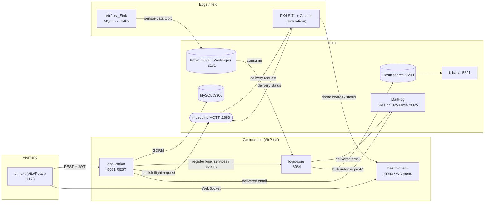
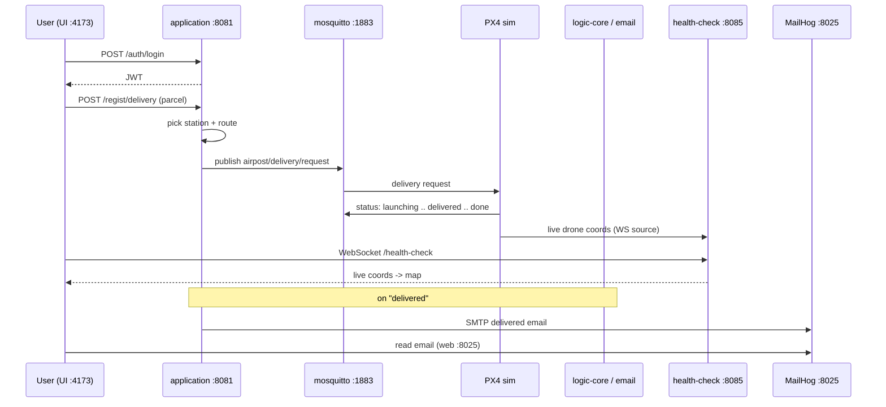

# Architecture

AirPost is one vertical spine: a user registers a parcel in the UI, the backend picks a
station + route and dispatches a flight over MQTT, the drone (simulated in PX4 + Gazebo)
flies the delivery and precision-lands, a "delivered" email is sent, and the flight is
tracked live on a map. A parallel sensor pipeline streams sink readings through Kafka into
Elasticsearch/Kibana.

See [`RUNBOOK.md`](./RUNBOOK.md) for the end-to-end demo and
[`../simulation/README.md`](../simulation/README.md) for the flight simulator.

## Components

## The delivery sequence

## Why these boundaries

- **application** owns persistence (MySQL) and the public REST surface; it is the only
  service the browser writes to, so auth + CORS live here.
- **logic-core** owns the data pipeline and rule engine (Kafka → rules → Elasticsearch,
  plus the email action), kept separate so sensor throughput never blocks the REST API.
- **health-check** owns only the live-tracking WebSocket fan-out — a small, single-purpose
  service so a slow browser client can't stall the API.
- **mosquitto** is the seam between software and the drone: the same MQTT contract works
  for the simulator today and real hardware later.

## Ports

| Component | In-network | Host |
|---|---|---|
| application | application:8081 | 8081 |
| logic-core | logic-core:8084 | 8084 |
| health-check | health-check:8083 / :8085 | 8083 / 8085 |
| ui-next | ui-next:4173 | 4173 |
| MySQL | mysql:3306 | 3306 |
| Kafka | kafka:29092 | 9092 |
| Zookeeper | zookeeper:2181 | 2181 |
| Elasticsearch | elasticsearch:9200 | 9200 |
| Kibana | kibana:5601 | 5601 |
| MailHog | mailhog:1025 / :8025 | 1025 / 8025 |
| mosquitto | mosquitto:1883 | 1883 |
