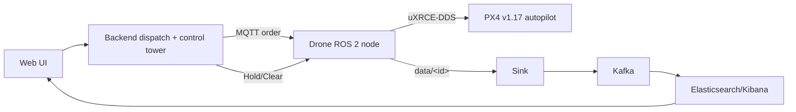

# AirPost — Autonomous Drone Parcel Delivery

**AirPost** is an end-to-end autonomous parcel-delivery system built by the SSU NC-Lab: a web app and
backend dispatch an order, a drone flies it, lowers the parcel by winch over the delivery point, and
camera-lands precisely back on a station — while every drone's telemetry streams live to a map and a
searchable data pipeline.

This site is the **system guide**. Start here, then dive into the per-component docs.

## The one-minute picture



- **Order → dispatch.** The UI/API creates a delivery; the backend assigns the nearest free drone, a
  deconfliction **altitude band**, and publishes the flight order.
- **Fly it.** The on-drone **ROS 2 node** (`airpost_drone`) commands PX4 v1.17 over the native
  **uXRCE-DDS** bridge — take off → cruise → lower the parcel by winch at ~10 m → return → **vision
  precision-land** on the station pad. It also does its **own local obstacle avoidance**.
- **Coordinate the fleet.** The backend **control tower** watches every drone's live position and tells
  a drone to **HOLD** when two get too close, **CLEAR**ing it once the airspace is free.
- **Observe.** Telemetry flows `data/<id>` → Sink → Kafka → Elasticsearch/Kibana, and the UI map tracks
  every drone live.

## Who does what (responsibility split)

| Layer | Owns |
|---|---|
| **Backend** (Go) | order dispatch, altitude-band assignment, **fleet-level monitoring + HOLD/CLEAR deconfliction**, notifications |
| **Drone** (ROS 2 on the companion) | flying the assigned mission, the winch, **local obstacle avoidance**, telemetry |
| **PX4 v1.17** (autopilot) | stabilization + low-level flight, exposed to ROS 2 over uXRCE-DDS |
| **Sink / Kafka / Elasticsearch** | durable telemetry pipeline + dashboards |
| **UI** (React + Leaflet/OSM) | place orders, watch the live map |

## Try it without hardware

Everything runs in simulation (PX4 SITL + Gazebo) — the *same* on-drone code that ships on the
Jetson+Pixhawk:

```bash
# the real on-drone ROS 2 stack against PX4 v1.17 over uXRCE-DDS
cd simulation && ORDER=1 GUI=1 ./run_ros2_fleet.sh 1

# or the MAVSDK fleet demo (verified 4 concurrent drones, precision landing)
SERVICE=1 GUI=1 ./run_airpost_fleet.sh 4
```

See **[Run it (operations)](RUNBOOK.md)** for the full bring-up (backend stack, broker, dependencies),
and **[Roadmap](FUTURE_WORK.md)** for what's done and what's next.

## Repositories

| Repo | What it is |
|---|---|
| [AirPost_Drone](https://github.com/SSU-NC-22/AirPost_Drone) | On-drone control. `main`/`humble` = ROS 2 + uXRCE-DDS; `noetic` = legacy ROS 1/MAVROS. |
| [AirPost_Backend](https://github.com/SSU-NC-22/AirPost_Backend) | Go services: dispatch, control-tower deconfliction, REST API. |
| [AirPost_Sink](https://github.com/SSU-NC-22/AirPost_Sink) | MQTT → Kafka telemetry bridge. |
| [AirPost_Station](https://github.com/SSU-NC-22/AirPost_Station) | Ground-station IoT node (sensors, landing pad/tag). |
| [AirPost_UI](https://github.com/SSU-NC-22/AirPost_UI) | React + Leaflet operator console. |
